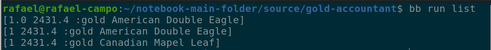
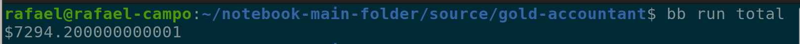
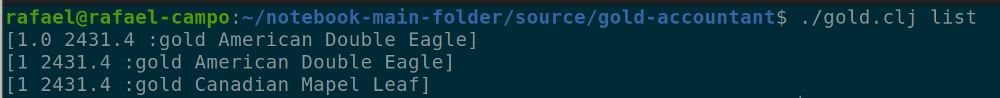
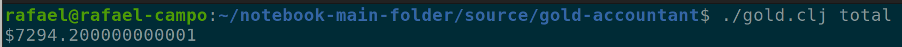
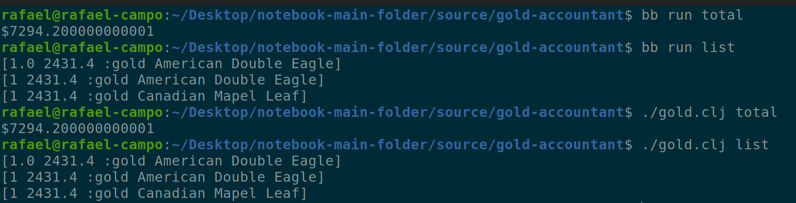

# gold-accountant

# Example Usage

To run the examples you must be able to run babashka from the command line.

> *Babashka* is a native Clojure interpreter for scripting with fast startup.

> Clojure is a concise, powerful, and performant general-purpose  programming language that runs on the Java Virtual Machine, Common Language Runtime, JavaScript runtimes (aka Node.js or modern mobile/desktop web browsers), and Babashka.

See the [Babashka documentation](https://github.com/babashka/babashka#installation) for more information

## Functions

There are two functions

- **list**: Returns an itemized list of the assets contained within the gold.edn file
- **total**: Returns the sum of the dollar value of all assets

## Run examples as a Babaska Task

### **List** - as a Babashka Task

`bb run list`

```
Output

[1.0 2431.4 :gold American Double Eagle]
[1 2431.4 :gold American Double Eagle]
[1 2431.4 :gold Canadian Mapel Leaf]
```



### **Total** - as a Babashka Task

bb run total

`bb run total` Output: `$7294.20`



## Run examples as a shell script

### **List** - as shell script

`./gold.clj list`

```
Output

[1.0 2431.4 :gold American Double Eagle]
[1 2431.4 :gold American Double Eagle]
[1 2431.4 :gold Canadian Mapel Leaf]
```



### **Total** - as shell script

`./gold.clj total` Output: `$7294.20`



---

### Demo of all functionality


